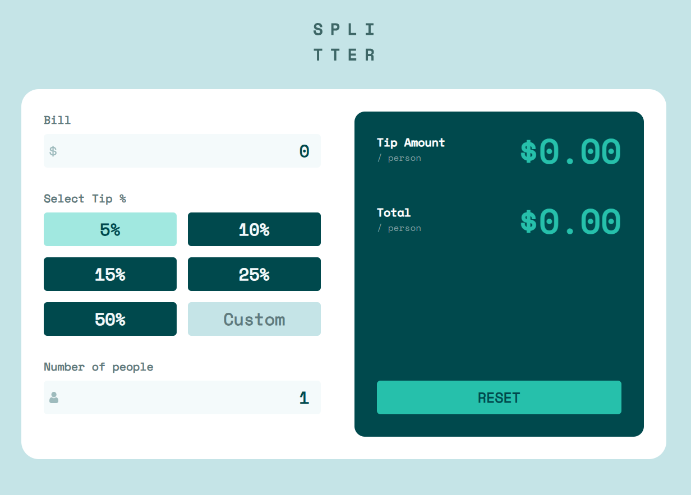

# Tip calculator app



## Características

Los usuarios pueden:

- Calcular la propina correcta y el costo total de la cuenta por persona
- Ver el diseño óptimo de la aplicación según el tamaño de pantalla de su dispositivo
- Ver los estados hover de todos los elementos interactivos en la página

## Tecnologías utilizadas
- REACT
- ZUSTAND
- TAILWIND
- TYPESCRIPT

## Explicación en video
[](https://www.youtube.com/watch?v=9WtElr5T4Mo)

## Comenzando

Para ejecutar este proyecto localmente, sigue estos pasos:

1. Clona el repositorio:
   ```bash
   git clone https://github.com/CodinGitHub/tip-calculator-app
   ```  
2. Navega al directorio del proyecto:
   ```bash
   cd tip-calculator-app
   ```
3. Instala las dependencias:
   ```bash
   npm install
   ```
4. Inicia el servidor de desarrollo:
   ```bash
   npm run dev
   ```

## Author

David Ruiz - Frontend Developer
- [Github](https://github.com/Davichobits)
- [Frontend Mentor](https://www.frontendmentor.io/profile/Davichobits) 
- [Linkedin](https://www.linkedin.com/in/davidirc/)
- [YouTube](https://www.youtube.com/CodingTube)
- [codingtube.dev](https://codingtube.dev/)

**¿Buscas clases particulares conmigo?** haz clic [aquí](https://www.classgap.com/es/tutor/david-577169):

## GitAds Sponsored
[](https://gitads.dev/v1/ad-track?source=codingithub/codingithub@github)